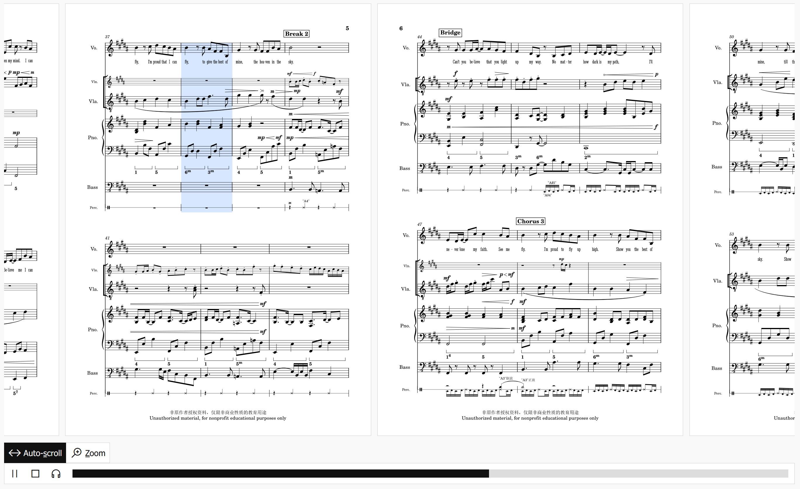

# MuseScore Web Display

> **This is not an officially supported/endoresed [MuseScore](https://musescore.org/) product.**



> [Buy me a coffee](https://afdian.net/a/yezhiyi9670) if you like this work.

This is a simple and elegant component allowing you create an interactive showcase of your score, similar to the score showcase seen on musescore.com. [See a working demo here](https://sparkslab.art/dictations/dict-proud-of-you/).

This library uses [Vue](https://vuejs.org/) and the [Line Awesome icon font](https://icons8.com/line-awesome). It is deliberately made into a global and buildless library for easy integration with site builders like WordPress.

## Features

- (kind of) mobile friendly.
- Render score pages horizontally, like the way they are in the MuseScore editor.
- Zoom: give a closer look to the score.
- Audio playback, with a cursor highlighting the current measure (auto-scroll included).
- Keyboard shortcuts.
- Optional two-track setup: The user can quickly switch between the regular version and the no-vocal version of exported audio during playback if you provide them.

## Running

This is a **buildless** library, hence does not require any build setup. Download the repository, host it via a local HTTP server and access `index.html` in your web browser.

Note that it won't work if you open `index.html` directly in your file explorer.

## Usage

### The Component

The main library is `score-display/score-display.global.js`, which exposes a global variable `ScoreDisplay`. It can be used as a Vue component.

| Property | Explanation |
| - | - |
| `src` | `string` \| URL to the directory containing the files of your score |
| `versionCode` | `string?` \| Can be any string, appears in query param while fetching files |
| `canPlay` | `boolean?` \| Whether to load audio `audio.ogg` and offer playback |
| `hasAltTrack` | `boolean?` \| Whether to offer the no-vocal audio `audio-alt.ogg` |

The directory that `src` points to should contain the following files [(example here)](./data/Proud%20Of%20You.mscz.wd/):

```plain
Score Directory
├─ meta.metajson     Score metadata
├─ audio.ogg         (optional) Exported audio
├─ audio-alt.ogg     (optional) No-vocal version of exported audio
├─ graphic-1.svg     SVG graphic of score pages, one for each page.
├─ graphic-....svg
├─ graphic-8.svg
└─ measures.mpos     Measure positions, for highlighting the current measure during playback.
```

They can all be exported from MuseScore using the [command line interface](https://musescore.org/en/handbook/3/command-line-options).

See also [the python scripts](./py-script/) that automatically exports all files. The scripts exports the audio for ALL part scores in the form of `audio-%s.ogg` by default, so you may add a part score called `alt` to automatically generate `audio-alt.ogg`.

### Integrating into existing HTML

In particular, you need to add the following into your website:

1. Line Awesome icon pack and Vue (global edition).

```html
<link rel= "stylesheet" href= "https://maxst.icons8.com/vue-static/landings/line-awesome/line-awesome/1.3.0/css/line-awesome.min.css" >
<script src="https://unpkg.com/vue@3/dist/vue.global.js"></script>
```

2. This library.

```html
<link rel="stylesheet" href="./score-display/score-display.css" />
<script src="./score-display/score-display.global.js"></script>
```

3. A container element for your score showcase.

```html
<div id="score-display-1" class="score-display-wrapper"></div>
```

4. Mounting script.

```html
<script>
  Vue.createApp({
    components: { ScoreDisplay },
    template: `<ScoreDisplay src="./data/Proud Of You.mscz.wd/" canPlay hasAltTrack versionCode="5" />`
  }).mount('#score-display-1')
</script>
```
